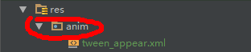

# Android Tween动画
可以为一个视图创建一系列的动画

## 一、基本用法：

### 1）先为项目创建一个Animation的资源文件夹：



### 2）在anim文件夹里面新建动画资源.xml文件
这里引用Google的实例代码，文件名为：<br/><br/>
hyperspace_jump.xml
```xml
<!-- set 动画动作的集合 -->
<!-- fillAfter 是否使动画停留在结束那一帧 -->
<set xmlns:android="http://schemas.android.com/apk/res/android"
    android:shareInterpolator="false">

    <scale
        android:interpolator="@android:anim/accelerate_decelerate_interpolator"
        android:fromXScale="1.0"
        android:toXScale="1.4"
        android:fromYScale="1.0"
        android:toYScale="0.6"
        android:pivotX="50%"
        android:pivotY="50%"
        android:fillAfter="false"
        android:duration="700" />
        <!-- startOffset 延迟开始 -->
    <set
        android:interpolator="@android:anim/accelerate_interpolator"
        android:startOffset="700">

        <scale
            android:fromXScale="1.4"
            android:toXScale="0.0"
            android:fromYScale="0.6"
            android:toYScale="0.0"
            android:pivotX="50%"
            android:pivotY="50%"
            android:duration="400" />
        <rotate
            android:fromDegrees="0"
            android:toDegrees="-45"
            android:toYScale="0.0"
            android:pivotX="50%"
            android:pivotY="50%"
            android:duration="400" />
    </set>
</set>

```

### 3）在对应的Activity里面注册动画：
这里的 R.id.img 是布局中的一个ImageView控件的id<br/>
context为当前Activity的上下文资源对象

```java

ImageView imageView = (ImageView)findViewById(R.id.img);
//注册动画，生成动画的对象
Animation animation = AnimationUtils.loadAnimation(context, R.anim.hyperspace_jump);

```
### 4）在适当的地方调用动画开始方法：
在需要使用动画的地方调用一下方法以开始动画，这里的imageView可以同理地换成其他View的子类，都是可以的
```java
//开始动画
imageView.startAnimation(animation);
```

## 二、重要元素及其参数

### `<alpha>` 透明度
  * duration：动画运行时间
  * fromAlpha：开始透明度 （0~1）0为透明
  * toAlpha：结束透明度 （0~1）0为透明

```xml
<alpha
        android:duration="1000"
        android:fromAlpha="0"
        android:toAlpha="1" />
```
### `<scale>` 形状
  * fromXScale：开始的x值 1.0为原始大小
  * fromYScale：开始的y值 1.0为原始大小
  * toXScale：目标的x值 1.0为原始大小
  * toYScale：目标的y值 1.0为原始大小
  * pivotX：形变中心x值 50%为原始图形x的中点
  * pivotY：形变中心y值 50%为原始图形y的中点

```xml
<scale
        android:fromXScale="1.0"
        android:toXScale="1.4"
        android:fromYScale="1.0"
        android:toYScale="0.6"
        android:pivotX="50%"
        android:pivotY="50%"
        android:fillAfter="false"
        android:duration="700" />
```

### `<rotate>` 旋转
  * fromDegrees：开始角度
  * toDegrees：目标角度
  * pivotX：旋转中心x值 50%为原始图形x的中点
  * pivotY：旋转中心y值 50%为原始图形y的中点

```xml
<rotate
           android:fromDegrees="0"
           android:toDegrees="-45"
           android:pivotX="50%"
           android:pivotY="50%"
           android:startOffset="700"
           android:duration="400" />
```

### `<translate>` 位移
  * fromXDelta：开始的x值（相对原图多少px）
  * fromYDelta：开始的y值（相对原图多少px）
  * toXDelta：目的的x值（相对原图多少px）
  * toYDelta：目的的y值（相对原图多少px）

```xml
<translate
        android:duration="1000"
        android:fromXDelta="0"
        android:fromYDelta="0"
        android:toXDelta="100"
        android:toYDelta="100" />
```

## 三、优缺点
### 优点：
Tween动画的优点是可以简单地通过使用xml和多个元素的配合写出简单而又实用的动画效果
### 缺点：
Tween动画的缺点是用Tween实现的动画都是只有视觉上的动画，调用动画的View无论是形状，大小，位置都与原来无异。简单概括就是Tween只是一个表面的动画

## 四、总结
目前Tween动画已经被基本弃用了，能用Tween动画做的效果基本都已经使用属性动画代替了
