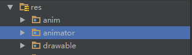

# Android 属性动画 ValueAnimator
Android 的属性动画就和它的名字一样，通过辅助类演算数值的变化
## ValueAnimator
### 一、ValueAnimator Java代码基础使用
#### 1）在适当的放声明 ValueAnimator
根据当前的环境决定应该声明成为局部变量还是全局变量
```java
  //声明一个属性值演算器，进行从100到3000的 float 值演算
  ValueAnimator valueAnimator = ValueAnimator.ofFloat(100.0f,3000.0f);
```
*PS：其实这里还可以选择演算其他的数值，后面会列出可用更换的方法*

#### 2）配置相关属性
这个部分是用于配置动画的一些属性，如：值的变化率，重复次数，重复模式等等
```java

    //设置动画运行时间为1000ms,即一秒
    valueAnimator.setDuration(1000);
    //设置动画重复的模式为倒转动画效果重新跑一次动画
    valueAnimator.setRepeatMode(ValueAnimator.REVERSE);
    //设置动画重复的次数为无限次
    valueAnimator.setRepeatCount(ValueAnimator.INFINITE);
    //设置动画中值的变化速率为逐渐加速
    valueAnimator.setInterpolator(new AccelerateInterpolator());
    //设置值的变化范围为300.0到200.0
    valueAnimator.setFloatValues(300.0f,200.0f);
    //设置在1000ms(1秒)延迟后再开始
    valueAnimator.setStartDelay(1000);

```
*PS：请根据需要来选择性设置*
#### 3）为演算器加入监听器
到目前位置我们只是配置好了值演算器，跟我们要进行动画的控件没有半毛钱关系，这时候我们就需要为值演算器加入监听器了，在每次值有所变化的时候我们进行相应的控件属性值的变化操作，这个就是ValueAnimator动画的核心
```java
  //声明好我们的监听器并初始化
  MyOnAnimtionUpdateListener listener = new MyOnAnimtionUpdateListener();

  //给Animator设置值变化监听器
  valueAnimator.addUpdateListener(listener);

  //声明实现了ValueAnimator.AnimatorUpdateListener接口的类
  class MyOnAnimtionUpdateListener implements ValueAnimator.AnimatorUpdateListener{
        @Override
        public void onAnimationUpdate(ValueAnimator animation) {
            //获取当前变化的值
            float value = (float) valueAnimator.getAnimatedValue();
            //假设我们之前就声明好了一个imageview，这里我们使它做绕Y轴旋转
            imagview.setRotationY(value);

        }
    }

```
*PS:每当Animator对值进行了一次的演算，就会调用一次实现了接口的类中的 onAnimationUpdate() 方法*<br/>
*PS:实现ValueAnimator.AnimatorUpdateListener的类可以是另外写的一个类，也可以是当前这一个Activity或Fragment，根据习惯和喜好来选择即可*

#### 4）运行动画
运行动画，我们只需要在需要动画运行起来的地方加入以下代码即可
```java

  //运行动画（演算器开始演算）
  valueAnimator.start();

```

### 二、ValueAnimator xml的使用
#### 1）新建 Animator 文件夹
在 res 文件夹下新建一个 animator 文件夹


#### 2）新建一个对应的animator动画xml文件
```xml

<animator xmlns:android="http://schemas.android.com/apk/res/android"
    android:duration="1000"
    android:valueFrom="1"
    android:valueTo="0"
    android:valueType="floatType"
    android:repeatCount="1"
    android:repeatMode="reverse"/>

```
  * duration：动画持续时间 [int]
  * valueType：值的类型 [ floatType | intType | colorType | pathType ]
  * valueFrom：开始的值 [对应类型的值]
  * valueTo：结束的值 [对应类型的值]
  * repeatCount：重复次数 [int]
  * repeatMode：重复模式 [ reverse | restart ]

#### 3）在使用到的Java代码中引用
由于属性都定义在了xml文件中，所以我们需要使用另一种 Inflator 的形式来新建 ValueAnimator
```Java

//假设我们已经按照前面的步骤声明了一个名为animator的xml文件
//使用 AnimatorInflater.loadAnimator 的方法，传入上下文资源，对应动画xml的id
ValueAnimator xmlAnimator = (ValueAnimator) AnimatorInflater.loadAnimator(this,R.animator.animator);

```
*PS：这样声明出来的ValueAnimator与前面Java声明出来的差别只在于这个xml方法声明出来的是携带着初始值的（就是xml中定义好的值）。如果有需要同样可以通过Java代码的方法去设置各个属性*

#### 4）为演算器加入监听器
*PS：参照 一、 3）*

#### 5）运行动画
*PS：参照 一、 4）*

### 三、ValueAnimator 方法参数详解
ValueAnimator中有定义好的各种方法，用于设置各种不同的效果等等

#### 1）设置动画运行时间 `void setDuration (long duration)`：
```java
//设置动画运行时间为1000ms,即一秒
valueAnimator.setDuration(1000);
```
##### 参数 `long duration`
  * 向方法里面传递的参数为一个long类型值。为动画运行的毫秒数<br/>
   *PS：1000ms = 1s = 1/60 min*

#### 2）设置动画的重复模式 `void setRepeatMode (int value)`
```java
//设置动画重复的模式为倒转动画效果重新跑一次动画
valueAnimator.setRepeatMode(ValueAnimator.REVERSE);
```
##### 参数 `int value`
  * 向方法里面传递一个int类型的值。为重复模式的代表值
  * ValueAnimator.RESTART = 1；表示重新开始
  * ValueAnimator.REVERSE = 2；表示倒过来执行一边

#### 3）设置动画的重复次数 `void setRepeatCount (int value)`
```java
//设置动画重复的次数为无限次
valueAnimator.setRepeatCount(ValueAnimator.INFINITE);
```
##### 参数 `int value`
  * 向方法里面传递一个int类型的值。为重复次数
  * 特殊参数 ValueAnimator.INFINITE = -1；表示无限次重复

#### 4）设置值的变化率 `void setInterpolator (TimeInterpolator value)`
```java
//设置动画中值的变化速率为逐渐加速
valueAnimator.setInterpolator(new AccelerateInterpolator());
```
##### 参数 `TimeInterpolator value`
  * 向方法里面传递一个TimeInterpolator类型的或实现了了TimeInterpolator接口的对象。为变化速率的变化依据
  * AccelerateInterpolator：加速类。数值的变化会越来越大，像加速度
  * DecelerateInterpolator：减速类。数值的变化会越来越小，像减速度

#### 5）设置延迟开始 `void setStartDelay (long startDelay)`
```java
//设置在1000ms(1秒)延迟后再开始
valueAnimator.setStartDelay(1000);
```
##### 参数 `long startDelay`
  * 向方法里面传递一个long类型的值。为延迟的时间长度的毫秒值<br/>
   *PS：1000ms = 1s = 1/60 min*

#### 6）设置数值变化范围 `void setFloatValues (float... values)`
```java
//设置值的变化范围为300.0到200.0
valueAnimator.setFloatValues(300.0f, 200.0f);
```
*PS：这个方法是设置Float值的变化范围的，其他类型都有这样的方法*

##### 参数 `float... values`
  * 向方法里面传递一个或多个float类型的变量值。从第一个按照设定好的变化率变化到第二个，再同理变化到第三个，有多少个就变化多少
  * 类似的方法还有：
    * 设置int类型的值变化范围 `void setIntValues (int... values)`
    * 设置Object类型的值变化范围 `void setObjectValues (Object... values)`
  <br/>*PS：如果看不懂float...的话，可以先了解一下Java的相关基础*

#### 7）动画状态的控制（必须在运行动画的线程上调用以下方法）
  * 开始 `start()`：开始动画
  * 重开 `resume()`：重新开始动画，接着之前的状态继续运行
  * 倒转 `reverse()`：反转动画，动画逆转运行
  * 取消 `cancel()`：取消动画，
  * 暂停 `pause()`：暂停动画，暂停并保存当前的动画的进度
  * 结束 `end()`：结束动画

### 四、总结
ValueAnimator 在动画的拓展性是比 Tween 动画好上一个等级的实现动画方式，但在仍存在着一些缺陷，例如：动画依旧是停留在视觉上，控件的位置和边界完全没有发生任何变化；在 7.0 以上的平台上无法正常运行。
