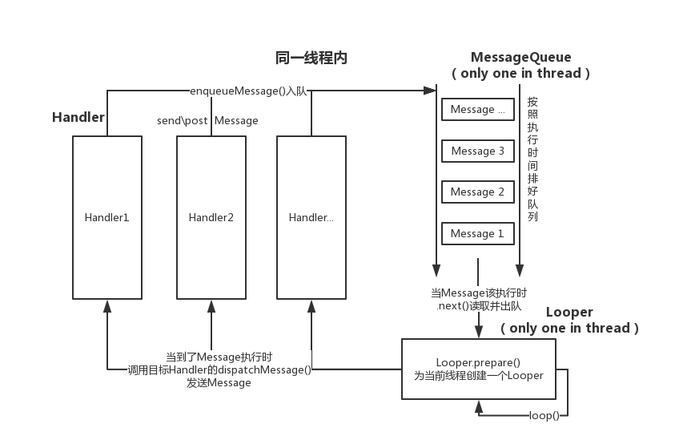

# Android Handler+Looper+MessageQueue
* Author：CrazyWah
* Date：2018.03.26
* CopyRight: crazywah.com

Android的消息机制主要由Handler、Looper和MessageQueue相互协助。

使用Looper为线程循环执行消息<br/>
使用Handler进行消息的发送和处理<br/>
使用Message携带消息的内容<br/>
使用MessageQueue管理消息队列

## 目录：
1. 机制简述
	1. Handler（处理器）：开发时最常接触到的上层控件
	2. Looper（循环器）
	3. Message（消息）
	4. MessageQueue（消息队列）
2. 源码分析
	1. Looper 源码分析
		1. Looper的惯常用法
		2. Looper的prepare()源码
		3. Looper的loop()源码
	2. Handler 源码分析
		1. Handler的惯常用法
		2. Handler构造函数源码
		3. Handler的事件分发
		4. Handler的各种send方法
			1. sendEmptyMessage(int what)
			2. sendEmptyMessageDelayed(int what, long delayMillis)
			3. sendMessageDelayed(Message msg, long delayMillis)
			4. sendMessageAtTime(Message msg, long uptimeMillis)
			5. enqueueMessage(MessageQueue queue, Message msg, long uptimeMillis)
		5. Handler的各种Post方法
			1. post(Runnable r)
			2. postAtTime(Runnable r, long uptimeMillis)
			3. postDelayed(Runnable r, long delayMillis)
			4. getPostMessage(Runnable r)
	3. Message 源码分析
		1. Message的结构
		2. Message的对象获取
	4. MessageQueue 源码分析
		1. next()
		2. enqueueMessage(Message msg, long when)
3. 总结

## 1、机制简述
以下控件全部都是在android.os包之下的
### 1.1、Handler（处理器）：开发时最常接触到的上层控件

* 每个Handler对象对应一个相关联的线程（Thread）和一个相关的消息队列（MessageQueue）。
* 处理器会捆绑在创建它的线程上
* Handler会将Message和Runnable交付到对应的MessageQueue上运行

* Handler有两个主要用途
	1. 统筹调度即将要执行的Runnable和Messages
	2. 将要跨线程执行的动作加入队列

* 我们可以通过`post(Runnable)`, `postAtTime(Runnable, long)`, `postDelayed(Runnable, Object, long)`, `sendEmptyMessage(int)`, `sendMessage(Message)`, `sendMessageAtTime(Message, long)`, 和 `sendMessageDelayed(Message, long)`方法来安排Message加入队列中。post开头的这些方法是用于指定你自己定义的Runnable加入队列中的。send开头的这些方法是用于你将数据封装到Bundle中并绑定在Message对象中然后由Handler中的handleMessage()方法进行处理。（当然，你必须先实现Handler的这个方法）

当应用的进程创建时，它的主线程，即用于管理最高级应用对象（如：activity、broadcast、service等）和任何由这些对象所创建的视窗的线程将用于运行MessageQueue消息队列。（说白了就是MessageQueue默认时运行在UI线程上的）。你可以通过Handler进行子线程和UI线程之间的通信。只需要在你的子线程上调用handler的send或post方法即可。你发送至Handler的Message或者Runnable将会在合适的时候被调度至消息队列并且处理。

### 1.2、Looper（循环器）

Looper是将绑定的线程用作循环运作Message的循环器。线程是默认没有消息循环器关联的，如果想要创建一个线程用作循环运作Message，在创建的线程运行之初调用Looper.prepare();然后调用Looper.loop();方法让线程开始循环处理消息直至Looper.end();被执行，结束这个线程的循环器（或线程被终止）。

许多和消息循环队列的交互通常是通过Handler实现的

### 1.3、Message（消息）

定义一个具有必要的属性和任意类型的数据的Message对象可以发送至Handler。该对象包括两个额外的int类型变量和一个Object类型变量在许多情况下可供自定义分配。

虽然Message的构造函数是对外开放的，但是官方建议我们多使用obtain()方法来获取Message的对象

### 1.4、MessageQueue（消息队列）

由Looper分配调度、用于管理Message队列的最高级类。Message并不是直接添加到MessageQueue中的，而是通过Handler对象关联至Looper。

你可以通过调用Looper.myQueue()来获取当前线程相关联的MessageQueue


## 2、源码分析

### 2.1、Looper 源码分析

#### 2.1.1、Looper的惯常用法

1. 创建一个装载Looper的线程
2. 在需要被制作为消息循环器的线程开始时调用Looper.prepare();为线程创建Looper对象
3. 在所有初始化完成后调用Looper.loop();开始循环执行消息队列。

```java
	class LooperThread extends Thread {
      	public Handler mHandler;

      	public void run() {
          	Looper.prepare();

         	 mHandler = new Handler() {
             	 public void handleMessage(Message msg) {
                  	// process incoming messages here
             	 }
         	 };
         	Looper.loop();
      	}
  	}
```

#### 2.1.2、Looper的prepare()源码
Looper的构造函数被私有了，唯一能创建Looper对象的方法就是调用prepare()方法了

```java
	/**
	 * 将当前线程初始化为一个Looper(循环器)，而后你可以在Looper调用loop()之前创建一个或多个Handler对象来引用这个Looper。
	 * 
	 * 必须在调用Looper.loop()之前先调用Looper.prepare()
	 *
	 * 可以调用Looper.end()结束Looper
	 */
    public static void prepare() {
        prepare(true);
    }

    private static void prepare(boolean quitAllowed) {
    	//如果当前线程中已经有Looper对象（即已调用过prepare()方法）则抛出异常
        if (sThreadLocal.get() != null) {
            throw new RuntimeException("Only one Looper may be created per thread");
        }
        sThreadLocal.set(new Looper(quitAllowed));
    }

    /**
     * 初始化当前Looper对象的：
     * 1. 创建消息队列
     * 2. 绑定当前线程对象
     */
    private Looper(boolean quitAllowed) {
        mQueue = new MessageQueue(quitAllowed);
        mThread = Thread.currentThread();
    }

```

#### 2.1.3、Looper的loop()源码
当为线程绑定好Looper（调用prepare()）并创建好Handler以后，我们就可以让Looper开始循环执行Message

```java
	/**
     * 在当前线程中运行消息队列中的消息
     */
    public static void loop() {
    	//获取当前线程的Looper对象
        final Looper me = myLooper();
        if (me == null) {
            throw new RuntimeException("No Looper; Looper.prepare() wasn't called on this thread.");
        }
        final MessageQueue queue = me.mQueue;

        ...

        //使用死循环来运行消息队列
        for (;;) {
            Message msg = queue.next(); // 可能会阻塞线程
            if (msg == null) {
                return;
            }

            ...

            //给信息对应的目标Handler分配Message
            try {
            	//调用信息绑定的目标Handler的dispatchMessage(msg)
                msg.target.dispatchMessage(msg);
                end = (slowDispatchThresholdMs == 0) ? 0 : SystemClock.uptimeMillis();
            } finally {
                if (traceTag != 0) {
                    Trace.traceEnd(traceTag);
                }
            }
            
            ...

            //将已处理完成的信息回归初始化，信息对象复用
            msg.recycleUnchecked();
        }
    }
```

### 2.2、Handler 源码分析

#### 2.2.1、Handler的惯常用法

1. 在需要使用到Handler的Looper线程中新建一个Handler（在Activity中新建的就是在UI线程中）
2. 定义CallBack接口
3. 在需要通知线程进行操作的时候调用 Handler 的 send 方法或 post 方法。（若是`send`类型的方法将会调用`CallBack`的`handlerMessage(Message msg)`、若是`post`类型的方法将会调用`post`时传递的`Runnable`对象中的`run()`方法）

```java
	private Hanlder handler = new Handler(new Handler.CallBack(){
		@Override
        public boolean handleMessage(Message msg) {
            //do something when get a message
            return false;
        }
	});

	//send message or post runnable when you want to notify the handler to do something
	handler.sendEmptyMessage(0);

```

#### 2.2.2、Handler构造函数源码
在使用Handler之前我们需要通过new获取Handler对象，那么Handler的构造函数都做了些什么呢

```java
	
	/**
	 * 该构造函数是默认同步状态，调用Handler(Callback callback, boolean async)创建Hanlder对象
	 */
    public Handler(Callback callback) {
        this(callback, false);
    }

	/**
	 * 初始化：
	 * 1. 获取线程中的Looper对象
	 * 2. 注入Handler中的CallBack对象
	 * 3. 初始化是否异步执行的flag
	 *
	 * Handler如果没有设置为异步的话，默认情况下是同步执行的
	 */
    public Handler(Callback callback, boolean async) {
        if (FIND_POTENTIAL_LEAKS) {
            final Class<? extends Handler> klass = getClass();
            if ((klass.isAnonymousClass() || klass.isMemberClass() || klass.isLocalClass()) &&
                    (klass.getModifiers() & Modifier.STATIC) == 0) {
                Log.w(TAG, "The following Handler class should be static or leaks might occur: " +
                    klass.getCanonicalName());
            }
        }

        //获取当前线程的线程共享Looper对象
        mLooper = Looper.myLooper();
        //如果当前线程共享变量中没有Looper对象则抛出异常
        if (mLooper == null) {
            throw new RuntimeException(
                "Can't create handler inside thread that has not called Looper.prepare()");
        }
        //获取Looper的消息队列
        mQueue = mLooper.mQueue;
        //绑定当前Handler对象的CallBack接口
        mCallback = callback;
        mAsynchronous = async;
    }

```

#### 2.2.3、Handler的事件分发

```java
	/**
     * 处理系统信息的方法
     */
    public void dispatchMessage(Message msg) {
    	//如果Message有callback，则直接运行它的CallBack（即Runnable）对象
        if (msg.callback != null) {
            handleCallback(msg);
        } else {
        	//如果有注入的CallBack对象则执行注入的CallBack对象的handleMessage()方法
            if (mCallback != null) {
                if (mCallback.handleMessage(msg)) {
                    return;
                }
            }
            handleMessage(msg);
        }
    }

    /**
     * 运行Message的callback
     */
	private static void handleCallback(Message message) {
        message.callback.run();
    }

```

#### 2.2.4、Handler的各种send方法

##### 2.2.4.1、sendEmptyMessage(int what)
即时发送空信息至消息队列

```java
	/**
     * 发送一条仅包含what属性的Message
     * 
     * 返回值为Boolean值，表示是否发送成功。
     * 一般情况下，发送失败是因为当前Looper的消息队列正在退出
     */
    public final boolean sendEmptyMessage(int what)
    {
    	//0延迟后发送信息
        return sendEmptyMessageDelayed(what, 0);
    }
```

##### 2.2.4.2、sendEmptyMessageDelayed(int what, long delayMillis)
延迟发送空信息至消息队列

```java
	/**
     * 延迟delayMillis毫秒后发送仅包含what属性的Message
     * 返回值为Boolean值，表示是否发送成功。
     * 一般情况下，发送失败是因为当前Looper的消息队列正在退出
     */
    public final boolean sendEmptyMessageDelayed(int what, long delayMillis) {
    	//从全局Message池中获取复用的Message对象，、
    	//若池中没有对象可供复用则new一个
        Message msg = Message.obtain();
        //赋值what属性
        msg.what = what;
        //调用发送
        return sendMessageDelayed(msg, delayMillis);
    }
```

##### 2.2.4.3、sendMessageDelayed(Message msg, long delayMillis)
延迟发送消息至消息队列

```java
	/**
     * 将消息入队并排列在目标时间(uptimeMillis)以前的任务之后。
	 * 该信息将会在对应的时间，被绑定好的handler对象中接收并传入handleMessage(Message msg)方法
     * 
     * 返回值为Boolean值，表示是否发送成功。
     * 一般情况下，发送失败是因为当前Looper的消息队列正在退出
	 */
    public final boolean sendMessageDelayed(Message msg, long delayMillis)
    {
        if (delayMillis < 0) {
            delayMillis = 0;
        }
        return sendMessageAtTime(msg, SystemClock.uptimeMillis() + delayMillis);
    }
```
##### 2.2.4.4、sendMessageAtTime(Message msg, long uptimeMillis)
在指定时间发送指定消息至消息队列

```java
	/**
	 * 将消息入队并排列在目标时间(uptimeMillis)以前的任务之后。
	 * 该信息将会在对应的时间，被绑定好的handler对象中接收并传入handleMessage(Message msg)方法
	 * 
	 */
    public boolean sendMessageAtTime(Message msg, long uptimeMillis) {
    	//Looper中的消息队列
        MessageQueue queue = mQueue;
        //如果队列不存在则抛出异常
        if (queue == null) {
            RuntimeException e = new RuntimeException(
                    this + " sendMessageAtTime() called with no mQueue");
            Log.w("Looper", e.getMessage(), e);
            return false;
        }
        return enqueueMessage(queue, msg, uptimeMillis);
    }
```
##### 2.2.4.5、enqueueMessage(MessageQueue queue, Message msg, long uptimeMillis)
将消息放入消息队列

```java
	/**
     * 根据Handler的是否异步处理的boolean值来设置Message是否异步处理
     * 调用MessageQueue的queueMessage(Message msg, long when)方法
	 */
	private boolean enqueueMessage(MessageQueue queue, Message msg, long uptimeMillis) {
        msg.target = this;
        if (mAsynchronous) {
            msg.setAsynchronous(true);
        }
        //使用for循环，根据设置好的Message.when找到消息该存放的位置，并插入到队列中
        return queue.enqueueMessage(msg, uptimeMillis);
    }
```

#### 2.2.5、Handler的各种Post方法

##### 2.2.5.1、post(Runnable r)
将一个Runnable即时发布到消息队列运行

```java
	public final boolean post(Runnable r)
    {
       return  sendMessageDelayed(getPostMessage(r), 0);
    }
```

##### 2.2.5.2、postAtTime(Runnable r, long uptimeMillis)
将一个Runnable按照暨定时间发布到消息队列运行

```java
	public final boolean postAtTime(Runnable r, long uptimeMillis)
    {
        return sendMessageAtTime(getPostMessage(r), uptimeMillis);
    }
```

##### 2.2.5.3、postDelayed(Runnable r, long delayMillis)
将一个Runnable延迟delayMillis毫秒后发布至消息队列运行

```java
	public final boolean postDelayed(Runnable r, long delayMillis)
    {
        return sendMessageDelayed(getPostMessage(r), delayMillis);
    }
```

##### 2.2.5.4、getPostMessage(Runnable r)
各post方法中用于包装Runnable成为Message的方法

```java
	private static Message getPostMessage(Runnable r) {
		//从全局Message池中获取复用的Message对象
        //若池中没有对象可供复用则new一个
        Message m = Message.obtain();
        m.callback = r;
        return m;
    }
```

### 2.3、Message 源码分析

#### 2.3.1、Message的结构

我们先大致地看一下Message对象的结构是长什么样的

```java
public final class Message implements Parcelable{
	/**
	 * 开发者自定义的消息码，用于标识消息的相关内容。
	 * 每个Handler都有自己的命名空间，不需担心会有冲突
     */
    public int what;

    /**
     * 用于简单存储的int值
     */
    public int arg1;

    /**
     * 用于简单存储的int值
     */
    public int arg2;

    /**
     * 存储任意对象用于发送给接收者
     */
    public Object obj;

    ...

    /**
     * 消息的处理时间
     */
    /*package*/ long when;

	/**
     * 消息附带的数据
     */
    /*package*/ Bundle data;

    /**
     * 发送目标Handler对象
     */
    /*package*/ Handler target;

    /**
     * 本消息的Runnable对象
     */
    /*package*/ Runnable callback;

    /**
     * 当前Message对象的下一个Message对象
     */
    /*package*/ Message next;

    /**
     * 用于多线程中对象锁的对象
     */
    private static final Object sPoolSync = new Object();

    /**
     * Message对象池
     */
    private static Message sPool;

    /**
     * Message对象池的大小
     */
    private static int sPoolSize = 0;

    /**
     * Message对象池的大小上限
     */
    private static final int MAX_POOL_SIZE = 50;

    /**
     * 当前Message对象是否可复用
     */
    private static boolean gCheckRecycle = true;
}
```

通过阅读Message的源码我们发现，Message存储了各种数据、目标Handler对象的引用和下一个Message对象的引用。从这Message的结构也能看出来，其实所谓的Message队列并不是队列结构而是链表结构。

为什么使用的是链表结构而不是队列结构，因为链表有助于元素的插入和删除。

#### 2.3.2、Message的对象获取

虽然Message的构造函数是对外开放的，但是官方建议我们多使用obtain()方法来获取Message的对象

**官方原文：**

*Constructor (but the preferred way to get a Message is to call  Message.obtain()).*

```java

	/** 
	 * 不建议使用
     */
    public Message() {
    }

	/**
     * 从本地Message池中获取Message对象
     * 如果本地池中没有Message对象则新建一个
     */
    public static Message obtain() {
        synchronized (sPoolSync) {
            if (sPool != null) {
                Message m = sPool;
                sPool = m.next;
                m.next = null;
                m.flags = 0; // clear in-use flag
                sPoolSize--;
                return m;
            }
        }
        return new Message();
    }

    /**
     * 和obtain()一样是返回一个Message对象
     * 区别在于，这个方法是拷贝Message参数的值赋予到新的Message对象
     */
    public static Message obtain(Message orig) {
        Message m = obtain();
        m.what = orig.what;
        m.arg1 = orig.arg1;
        m.arg2 = orig.arg2;
        m.obj = orig.obj;
        m.replyTo = orig.replyTo;
        m.sendingUid = orig.sendingUid;
        if (orig.data != null) {
            m.data = new Bundle(orig.data);
        }
        m.target = orig.target;
        m.callback = orig.callback;
        return m;
    }

    /**
     * 获取一个指定目标Handler的Message对象
     */
    public static Message obtain(Handler h) {
        Message m = obtain();
        m.target = h;
        return m;
    }

    /**
     * 获取一个指定目标Handler和可运行callback的Message对象
     */
    public static Message obtain(Handler h, Runnable callback) {
        Message m = obtain();
        m.target = h;
        m.callback = callback;
        return m;
    }

    /**
     * 获取一个指定目标Handler和指定运行时间when的Message对象
     */
    public static Message obtain(Handler h, int what) {
        Message m = obtain();
        m.target = h;
        m.what = what;

        return m;
    }

    /**
     * 获取一个
     * 指定目标Handler
     * 指定内容码
     * 绑定任意对象数据
     * 的Message对象
     */
    public static Message obtain(Handler h, int what, Object obj) {
        Message m = obtain();
        m.target = h;
        m.what = what;
        m.obj = obj;
        return m;
    }

    /**
     * 获取一个
     * 指定目标Handler
     * 指定内容码
     * 绑定int类型数据arg1
     * 绑定int类型数据arg2
     * 的Message对象
     */
    public static Message obtain(Handler h, int what, int arg1, int arg2) {
        Message m = obtain();
        m.target = h;
        m.what = what;
        m.arg1 = arg1;
        m.arg2 = arg2;

        return m;
    }

    /**
     * 获取一个
     * 指定目标Handler
     * 指定内容码
     * 绑定int类型数据arg1
     * 绑定int类型数据arg2
     * 绑定任意对象数据
     * 的Message对象
     */
    public static Message obtain(Handler h, int what,
            int arg1, int arg2, Object obj) {
        Message m = obtain();
        m.target = h;
        m.what = what;
        m.arg1 = arg1;
        m.arg2 = arg2;
        m.obj = obj;

        return m;
    }

```

### 2.4、MessageQueue 源码分析
MessageQueue的主要作用是管理Message消息的出队读取数据与入队

#### 2.4.1、next()
从Message队列中读取消息内容并让Message出队

```java
Message next() {
        
        ...

        //死循环以从队列找出有效的Message对象
        for (;;) {
            
            ...

            //使用本地方法从队列中取出一个Message节点
            nativePollOnce(ptr, nextPollTimeoutMillis);

            synchronized (this) {
                // Try to retrieve the next message.  Return if found.
                final long now = SystemClock.uptimeMillis();
                Message prevMsg = null;
                Message msg = mMessages;
                
                ...

                if (msg != null) {
                    if (now < msg.when) {
                        // Next message is not ready.  Set a timeout to wake up when it is ready.
                        nextPollTimeoutMillis = (int) Math.min(msg.when - now, Integer.MAX_VALUE);
                    } else {
                    	//当消息到了该执行的时间则将消息从消息队列拉出并返回
                        // Got a message.
                        mBlocked = false;
                        if (prevMsg != null) {
                            prevMsg.next = msg.next;
                        } else {
                            mMessages = msg.next;
                        }
                        msg.next = null;
                        if (DEBUG) Log.v(TAG, "Returning message: " + msg);
                        msg.markInUse();
                        return msg;
                    }
                } else {
                    // No more messages.
                    nextPollTimeoutMillis = -1;
                }

                ...
            }

            ...

        }
    }
```

#### 2.4.2、enqueueMessage(Message msg, long when)
Message消息的入队

```java
boolean enqueueMessage(Message msg, long when) {
        
        ...

        synchronized (this) {
            
            ...

            msg.markInUse();
            msg.when = when;
            Message p = mMessages;
            boolean needWake;
            if (p == null || when == 0 || when < p.when) {
                // New head, wake up the event queue if blocked.
                msg.next = p;
                mMessages = msg;
                needWake = mBlocked;
            } else {
            	//将Message消息插入消息队列的中间
            	needWake = mBlocked && p.target == null && msg.isAsynchronous();
                Message prev;
                for (;;) {
                    prev = p;
                    p = p.next;
                    if (p == null || when < p.when) {
                        break;
                    }
                    if (needWake && p.isAsynchronous()) {
                        needWake = false;
                    }
                }
                msg.next = p; // invariant: p == prev.next
                prev.next = msg;
            }

            // We can assume mPtr != 0 because mQuitting is false.
            if (needWake) {
                nativeWake(mPtr);
            }
        }
        return true;
    }
```

## 3、总结
经过几天的源码阅读，我大致地摸清楚了Android的Handller+Looper+MessageQueue合作的消息机制，可总结为以下这幅流程图



如果以上总结有任何错漏之处非常欢迎各位在issue处提出错误处

## 番外
面试中被面试官问到了一点：如果 Looper 的线程睡了 10 秒，那么本应该在这期间执行的事件会如何执行呢？大家不妨思考一下

解答：

其实虽然 Message 是一个伪队列，但是在 next() 的时候 Message 在调用 messgae.next() 以后并不是无脑外抛的，而是做了一次时间比较，看看消息的 msg.when 和当前时间 now 谁更大，然后再外抛的

```java
class MessageQueue{
	Message next() {
		...
		for (;;) {
		    synchronized (this) {
			final long now = SystemClock.uptimeMillis();
			Message prevMsg = null;
			Message msg = mMessages;
			...
			if (msg != null) {
			    // 这个就是关键的时间判断代码 <------------!!!!!!!!!!!!!!!!!!!!
			    if (now < msg.when) {
				// Next message is not ready.  Set a timeout to wake up when it is ready.
			    } else {
				// Got a message.
				...
				return msg;
			    }
			} else {
			    // No more messages.
			    ...
			}
			...
		    }
		    ...
		}
	    }
}
```

既然知道了 Looper 怎么拿到一个消息，那就好办了，我们看看消息的 msg.when 怎么来就可以破案了：

```java
class Handler{
    public final boolean sendMessageDelayed(Message msg, long delayMillis){
        if (delayMillis < 0) {
            delayMillis = 0;
        }
	// 留意这里根据当前时间计算了一次当前 Message 准确的运行时间 <--------------------!!!!
        return sendMessageAtTime(msg, SystemClock.uptimeMillis() + delayMillis);
    }

    public boolean sendMessageAtTime(Message msg, long uptimeMillis) {
        ...
	// 消息直接以 udateMillis 入消息队列了 <--------------------!!!!
        return enqueueMessage(queue, msg, uptimeMillis);
    }
}
```

所以破案了！如果线程睡了十秒钟，这期间本该执行的 Message 会在线程重新醒来的时候全部执行！🤪
