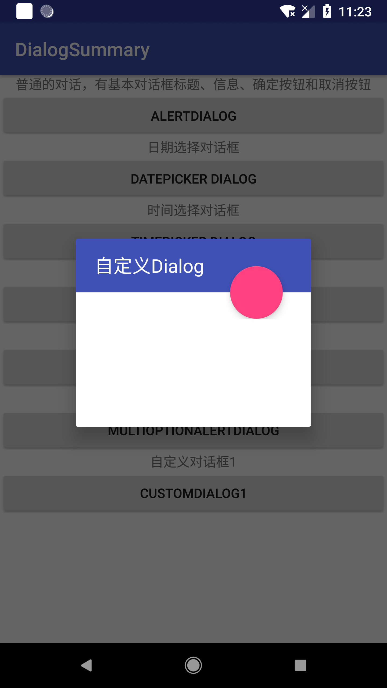
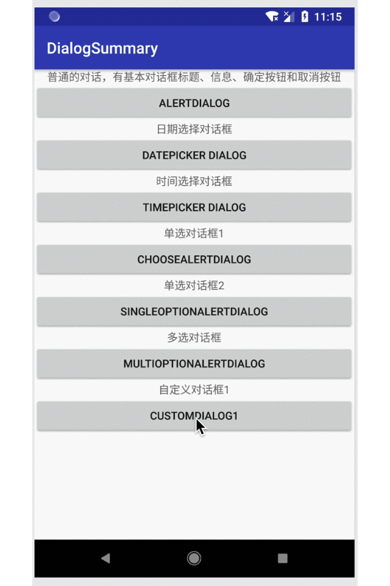

# Android Dialog （二）自定义
* Author:CrazyWah
* Date:2018.07.28
* CopyRight:crazywah.com

上一篇总结中，我总结了 Dialog 的一些系统定义的用法，但是毕竟用别人的手短，始终会有各种各样的限制。
所以更多时候，我们还需要自己自定义各种东西，这时候，理解Dialog的运行方式和构造方式对自定义就显得尤为重要了

## 1、Dialog 的运行机理

实际上，Dialog的运行机理就是在当前的窗口上面再覆盖了一层窗口

我为了验证着一点在Activity中加了一个这样的代码：

```java
Log.v("DialogTest","is the Windows the same? "+MainActivity.this.getWindow().equals(dialog.getWindow()));
```

结果：

```
07-28 10:52:17.019 19170-19170/com.example.crazywah.dialogsummary V/DialogTest: is the Windows the same? false
```

### 1.1、Dialog 的创建：

从 Dialog 的创建过程我们可以看到，Dialog 获取了上下文资源以后做了两件事：
1. 根据传递值判断是否重新包装上下文资源。

```java
        if (createContextThemeWrapper) {
            if (themeResId == ResourceId.ID_NULL) {
                final TypedValue outValue = new TypedValue();
                context.getTheme().resolveAttribute(R.attr.dialogTheme, outValue, true);
                themeResId = outValue.resourceId;
            }
            mContext = new ContextThemeWrapper(context, themeResId);
        } else {
            mContext = context;
        }
```

2. 新建了一个 Windows 对象并将该对象托付于系统的 WindowManager 来管理。

```java
        mWindowManager = (WindowManager) context.getSystemService(Context.WINDOW_SERVICE);

        final Window w = new PhoneWindow(mContext);
        mWindow = w;
        w.setCallback(this);
        w.setOnWindowDismissedCallback(this);
        w.setOnWindowSwipeDismissedCallback(() -> {
            if (mCancelable) {
                cancel();
            }
        });
        w.setWindowManager(mWindowManager, null, null);
        w.setGravity(Gravity.CENTER);
```

这些代码正是我说的在当前的窗口上方覆盖一个新的窗口来实现对话框

### 1.2、Dialog 视图的配置

通过上面创建的部分我们不难发现，创建 Dialog 仅仅创建了一个新的窗口图层在当前的界面之上而已，那么显然我们的视图是还没有建立起来的，这时候就需要借助 `setContentView()` 方法了。

```java
    public void setContentView(@NonNull View view) {
        mWindow.setContentView(view);
    }
```

显然，其实 Dialog 的 `setContentView()` 仅仅是调用了Window对象的 `setContentView` 而已，即为当前这个窗口配置视图。

### 1.3、Dialog 的显示

在 Dialog 的 `show()` 方法中，主要是进行最后的参数配置，然后则是把设置完的从 mWindow 中获取出来的 View 即我们通过 `setContentView` 配置的 ContentView 添加到系统 WindowManager 中，然后通过 sendMessage 的方式更新主线程让 Dialog 显示出来

```java
        mDecor = mWindow.getDecorView();

        if (mActionBar == null && mWindow.hasFeature(Window.FEATURE_ACTION_BAR)) {
            final ApplicationInfo info = mContext.getApplicationInfo();
            mWindow.setDefaultIcon(info.icon);
            mWindow.setDefaultLogo(info.logo);
            mActionBar = new WindowDecorActionBar(this);
        }

        WindowManager.LayoutParams l = mWindow.getAttributes();
        if ((l.softInputMode
                & WindowManager.LayoutParams.SOFT_INPUT_IS_FORWARD_NAVIGATION) == 0) {
            WindowManager.LayoutParams nl = new WindowManager.LayoutParams();
            nl.copyFrom(l);
            nl.softInputMode |=
                    WindowManager.LayoutParams.SOFT_INPUT_IS_FORWARD_NAVIGATION;
            l = nl;
        }

        mWindowManager.addView(mDecor, l);
        mShowing = true;

        sendShowMessage();
```

## 2、Dialog 的自定义

上面介绍了一下 Dialog 的运行机理，那么大概的我们就能看到了允许我们自定义的点了：

1. 样式参数
2. 界面视图

### 2.1、自定义视图 Dialog

#### 2.1.1、自定义 Dialog 的视图 xml

定制你需要的视图

```xml

<?xml version="1.0" encoding="utf-8"?>
<RelativeLayout xmlns:android="http://schemas.android.com/apk/res/android"
    android:layout_width="250dp"
    android:layout_height="200dp"
    xmlns:app="http://schemas.android.com/apk/res-auto"
    android:orientation="vertical">

    <LinearLayout
        android:layout_width="match_parent"
        android:layout_height="match_parent"
        android:orientation="vertical">

        <RelativeLayout
            android:layout_width="match_parent"
            android:layout_height="0dp"
            android:layout_weight="2"
            android:background="@color/colorPrimary" >

            <TextView
                android:layout_centerVertical="true"
                android:layout_marginLeft="20dp"
                android:textColor="@android:color/white"
                android:textSize="20sp"
                android:text="自定义Dialog"
                android:layout_width="wrap_content"
                android:layout_height="wrap_content" />

        </RelativeLayout>

        <View
            android:layout_width="match_parent"
            android:layout_height="0dp"
            android:layout_weight="5" />

    </LinearLayout>

    <LinearLayout
        android:layout_width="match_parent"
        android:layout_height="match_parent"
        android:orientation="vertical">

        <View
            android:layout_width="match_parent"
            android:layout_height="0dp"
            android:layout_weight="1" />

        <RelativeLayout
            android:layout_width="match_parent"
            android:layout_height="0dp"
            android:layout_weight="2">

            <android.support.design.widget.FloatingActionButton
                app:fabSize="normal"
                android:layout_alignParentRight="true"
                android:layout_marginRight="30dp"
                android:layout_width="wrap_content"
                android:layout_height="wrap_content"
                android:layout_centerVertical="true" />

        </RelativeLayout>

        <View
            android:layout_width="match_parent"
            android:layout_height="0dp"
            android:layout_weight="4" />

    </LinearLayout>

</RelativeLayout>

```

#### 2.1.2、在 Java 代码中对 Dialog 进行初始化和参数设置

根据 Dialog 的运行机理，我们需要给 Dialog 传递当前的上下文对象，然后在调用其 `show()` 方法之前完成一系列的初始化和设置，如 `setContentView()` 等设置

```java
    //创建 Dialog 对象
    Dialog dialog = new Dialog(this);
    //创建 Dialog 的视图
    View contentView = getLayoutInflater().inflate(R.layout.dialog_custom_1, null, false);
    //新建 Dialog 视图的参数对象
    ViewGroup.LayoutParams layoutParams = new ViewGroup.LayoutParams((int) TypedValue.applyDimension(TypedValue.COMPLEX_UNIT_DIP, 250, getResources().getDisplayMetrics()), (int) TypedValue.applyDimension(TypedValue.COMPLEX_UNIT_DIP, 200, getResources().getDisplayMetrics()));

    dialog.setContentView(contentView,layoutParams);
```

值得注意的是，为什么我们需要加上 `LayoutParams` 呢，主要还是因为我们新建 Dialog 是在一个全新的 Window 对象上新建的，所以 **`Dialog` 之上并没有父级 View**，所以在自定义的 Dialog 视图布局 xml 上最外曾的 View 或 ViewGroup 设置的 **`layout_width` 和 `layout_height` 参数不会生效**，会导致我们的自定义 View 走样。（有兴趣的可以试试不加 LayoutParams 看看有多奇特）

#### 2.1.3、在需要的地方进行显示

```java
    dialog.show();
```

#### 2.1.4、效果图



### 2.2、自定义 Dialog 动画样式

自定义 Dialog 的样式可以做很多事情

#### 2.2.1、自定义 Dialog 的出入动画

我们可以利用样式的定义来实现满足需求的 Dialog 出入动画效果

#### 2.2.2、新建出现和消失的动画

定义出现动画 enter_anim.xml

```xml
<?xml version="1.0" encoding="utf-8"?>
<set xmlns:android="http://schemas.android.com/apk/res/android"
    android:duration="200">
    <alpha
        android:fromAlpha="0"
        android:toAlpha="1" />
    <translate
        android:fromXDelta="-100%"
        android:toXDelta="0%" />
</set>
```

定义消失动画 exit_anim.xml

```xml
<?xml version="1.0" encoding="utf-8"?>
<set xmlns:android="http://schemas.android.com/apk/res/android"
    android:duration="200">
    <alpha
        android:fromAlpha="1"
        android:toAlpha="0" />
    <translate
        android:fromXDelta="0%"
        android:toXDelta="-100%" />
</set>
```

#### 2.2.3、新建动画 style

将刚定义好的动画文件放到一个新建的动画 style 中

```xml
<style name="CustomDialogAnimTheme" parent="android:Animation.Dialog">
    <item name="android:windowEnterAnimation">@anim/enter_anim</item>
    <item name="android:windowExitAnimation">@anim/exit_anim</item>
</style>
```

注意 `android:` 不能省，会报参数无法找到错误

#### 2.2.4、给 Dialog 设置动画样式

在原理中我们提到，其实 Dialog 就是一个新的窗口对象上的视图，所以我们改变的也是这个窗口对象的动画样式

```java
dialog.getWindow().setWindowAnimations(R.style.CustomDialogAnimTheme);
```

#### 2.2.5、效果图：



### 2.3、自定义 Dialog 的主题样式

在 Dialog 的构造函数有这么一段：

```java

public Dialog(@NonNull Context context, @StyleRes int themeResId) {
    this(context, themeResId, true);
}

Dialog(@NonNull Context context, @StyleRes int themeResId, boolean createContextThemeWrapper) {
    if (createContextThemeWrapper) {
        if (themeResId == ResourceId.ID_NULL) {
            final TypedValue outValue = new TypedValue();
                context.getTheme().resolveAttribute(R.attr.dialogTheme, outValue, true);
            themeResId = outValue.resourceId;
        }
        mContext = new ContextThemeWrapper(context, themeResId);
    } else {
        mContext = context;
    }
    ......
}
```

大致的意思就是：如果创建时传递了样式资源文件，那么将用该样式包装上下文资源用于后面的所有 Dialog 的相关创建

显而易见，这个样式是允许我们定义的

#### 2.3.1、在样式文件中添加我们自己的样式

```xml
    <style name="CustomDialogTheme" parent="@android:style/Theme.Dialog">
        <!--Dialog的windowFrame框为无-->
        <item name="android:windowFrame">@null</item>
        <!--是否浮现在activity之上-->
        <item name="android:windowIsFloating">true</item>
        <!--是否半透明-->
        <item name="android:windowIsTranslucent">true</item>
        <!--是否显示title-->
        <item name="android:windowNoTitle">true</item>
       <!--设置dialog的背景，（#00000000）-->
        <item name="android:background">@android:color/transparent</item>
        <!--显示区域背景是否透明，（#00000000）-->
        <item name="android:windowBackground">@android:color/transparent</item>
        <!--就是用来控制灰度的值，当为1时，界面除了我们的dialog内容是高亮显示的，dialog以外的区域是黑色的，完全看不到其他内容，系统的默认值是0.5-->
        <item name="android:backgroundDimAmount">0.5</item>
        <!--显示区域以外是否使用黑色半透明背景-->
        <item name="android:backgroundDimEnabled">true</item>
    </style>
```

#### 2.3.2、配置主题样式

在新建 Dialog 的时候传递样式资源

```java
  Dialog dialog = new Dialog(context,R.style.CustomDialogTheme);
```

#### 2.3.3、效果

由于样式众多就不一一演示了，在代码中有详细的注释说明

## 3、总结

至此，对 Dialog 的分析和自定义就完结了，尽管可能不是很详尽，但是其基本的运行机理以及能满足业务需求的自定义的方法都已经收纳到这一次的总结了，有更多新知识的时候，后续再补充。
