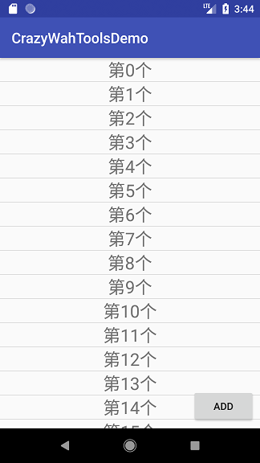

# Android ListView使用与源码分析
* Author：CrazyWah
* Date：2018.03.27
* CopyRight:crazywah.com

## 目录
1. ListView简介
2. ListView用法
3. ListView源码分析
4. 总结

## 1、ListView简介
ListView---是一个纵向可滑动的视图集合，在该集合中，View都是被紧凑地，一个接一个地安排在里面。

A list view is an adapter view that does not know the details, such as type and contents, of the views it contains. Instead list view requests views on demand from a ListAdapter as needed, such as to display new views as the user scrolls up or down.

In order to display items in the list, call setAdapter(ListAdapter) to associate an adapter with the list. For a simple example, see the discussion of filling an adapter view with text in the Layouts guide.

To display a more custom view for each item in your dataset, implement a ListAdapter. For example, extend BaseAdapter and create and configure the view for each data item in getView(...):

ListView attempts to reuse view objects in order to improve performance and avoid a lag in response to user scrolls. To take advantage of this feature, check if the convertView provided to getView(...) is null before creating or inflating a new view object. See Making ListView Scrolling Smooth for more ways to ensure a smooth user experience.

For a more complete example of creating a custom adapter, see the Custom Choice List sample app.

To specify an action when a user clicks or taps on a single list item, see Handling click events.

To learn how to populate a list view with a CursorAdapter, see the discussion of filling an adapter view with text in the Layouts guide. See Using a Loader to learn how to avoid blocking the main thread when using a cursor.

Note, many examples use ListActivity or ListFragment to display a list view. Instead, favor the more flexible approach when writing your own app: use a more generic Activity subclass or Fragment subclass and add a list view to the layout or view hierarchy directly. This approach gives you more direct control of the list view and adapter.

Summary

ListView适用的场景非常的多：通讯录、消息列表、

（更新、更流畅而且性能更佳的视图集合控件可以看 [RecyclerView]() ）

ListView示例图



## 2、ListView用法
一个完整的ListView的使用需要3个类配合使用：

1. ListView（UI控件）用于把内容显示在屏幕上给用户交互
2. Adapter（数据适配器）用于把数据和UI控件关联起来
3. ViewHolder（数据复用类）用于把当前的数据存储起来再复用

### 2.1、创建ListView：
#### 2.1.1、使用XML创建ListView
##### 1）在需要使用ListView的`XXX.xml`布局文件中声明ListView：

```xml

<ListView
	android:id="@+id/listview"
	android:layout_width="wrap_content"
	android:layout_height="wrap_content"/>

```

*以上代码仅供参考，请结合实际情况选择适合的参数*

##### 2）在布局文件对应的`XXXActivity.java`文件中获取布局中的ListView

```java
public class XXXActivity extends Activity{

	private ListView listView; 
	
	@Override
    protected void onCreate(@Nullable Bundle savedInstanceState) {
        super.onCreate(savedInstanceState);
        setContentView(R.layout.XXX);	//布局XXX.xml的id
        //获取布局中的ListView
        listView = findViewById(R.id.listview);
    }

}
```

#### 2.1.2、使用Java创建ListView
1）在需要创建ListView的`XXXActivity.java`中直接新建全部UI控件

```java

public class XXXActivity extends Activity{

	private RelativeLayout relativeLayout;
	private ListView listView; 
	
	@Override
    protected void onCreate(@Nullable Bundle savedInstanceState) {
        super.onCreate(savedInstanceState);
        relativeLayout = new RelativeLayout(this);
        relativeLayout.setLayoutParams(new ViewGroup.LayoutParams(ViewGroup.LayoutParams.MATCH_PARENT, ViewGroup.LayoutParams.MATCH_PARENT));
        setContentView(relativeLayout);	//将RelativeLayout设置为该Activity的父布局
        //新建ListView对象
        listView = new ListView(this);
        RelativeLayout.LayoutParams params = new RelativeLayout.LayoutParams(ViewGroup.LayoutParams.MATCH_PARENT, ViewGroup.LayoutParams.MATCH_PARENT);
        //设置ListView的参数
        listView.setLayoutParams(params);
        //将listView添加到父布局中
        relativeLayout.addView(listView);
    }

}
```

### 2.2、新建符合ListView子item布局的ViewHolder复用类
ViewHolder的主要用途是在第一次创建ListView中子item时将子item的布局中的所有控件的引用保存起来，这样下次再访问相同位置的子item时就不需要再重新创建item，提高ListView的子item的复用性能。

如我例子中子item的布局中只有一个TextView，那么在ViewHolder中就只需要保存一个TextView的引用

```java

public class ListViewHolder{
	
	public TextView textview;

}

```

### 2.3、新建符合交互逻辑的Adapter类
因为Adapter的作用是把数据关联到UI的ListView上，所以这个Adapter在整个ListView的使用中起举足轻重的作用，它的逻辑需要结合实际情况进行设计。

自定义的Adapter类继承BaseAdapter要实现以下方法：

1. public int getCount()	该函数的返回值是用于决定ListView显示的item总数
2. public Object getItem(int position)	该函数用于获取当前位置item的数据
3. public long getItemId(int position)	获取当前item的位置
4. public View getView(int position, View convertView, ViewGroup parent)	该函数的返回值是用于获取当前位置的View对象

#### 透过xml代码实现布局，示例如下：

```java

public class ListViewSampleAdpter extends BaseAdapter {

    private List<Integer> integers;

	//通过构造函数获取ListView的数据
    public ListViewSampleAdpter(List<Integer> relativeLayouts){
        this.integers = relativeLayouts;
    }

    @Override
    public int getCount() {
        return integers.size();
    }

    @Override
    public Object getItem(int position) {
        return integers.get(position);
    }

    @Override
    public long getItemId(int position) {
        return position;
    }

    @Override
    public View getView(int position, View convertView, ViewGroup parent) {
        ListViewHolder listViewHolder = null;
        //判断当前子item的View是否第一次创建
        if (convertView==null){

        	/*----初始化布局----*/
            convertView = LayoutInflater.from(parent.getContext()).inflate(R.layout.item,parent,false);
            /*----初始化布局----*/

            //初始化时创建一个复用对象保存对UI控件的引用
            listViewHolder = new ListViewHolder();
            //初始化对象的引用
            listViewHolder.textView = convertView.findViewById(R.id.textview);
            //将复用类保存到View对象中携带
            convertView.setTag(listViewHolder);
        }else{
        	//如果不是初始化，直接提取复用类对象
        	//修改数据只需要对Viewholder对象保存的布局控件引用进行修改即可
            listViewHolder = (ListViewHolder) convertView.getTag();
        }

        /*----设置数据----*/
        listViewHolder.textView.setText("第"+integers.get(position)+"个");
        /*----设置数据----*/

        return convertView;
    }
}
```

#### Java代码实现布局，示例如下：

```java

public class ListViewSampleAdpter extends BaseAdapter {

    private List<Integer> integers;

    //通过构造函数获取ListView的数据
    public ListViewSampleAdpter(List<Integer> relativeLayouts){
        this.integers = relativeLayouts;
    }

    @Override
    public int getCount() {
        return integers.size();
    }

    @Override
    public Object getItem(int position) {
        return integers.get(position);
    }

    @Override
    public long getItemId(int position) {
        return position;
    }

    @Override
    public View getView(int position, View convertView, ViewGroup parent) {
        ListViewHolder listViewHolder = null;
        //判断当前子item的View是否第一次创建
        if (convertView==null){

        	/*----初始化布局----*/
            RelativeLayout tempParent = new RelativeLayout(parent.getContext());
            tempParent.setLayoutParams(new ViewGroup.LayoutParams(ViewGroup.LayoutParams.MATCH_PARENT, ViewGroup.LayoutParams.WRAP_CONTENT));
            TextView tempText = new TextView(parent.getContext());
            tempParent.addView(tempText);
            convertView = tempParent;
            /*----初始化布局----*/

            //初始化时创建一个复用对象保存对UI控件的引用
            listViewHolder = new ListViewHolder();
            //初始化对象的引用
            listViewHolder.textView = tempText;
            //将复用类保存到View对象中携带
            convertView.setTag(listViewHolder);
        }else{
        	//如果不是初始化，直接提取复用类对象
        	//修改数据只需要对Viewholder对象保存的布局控件引用进行修改即可
            listViewHolder = (ListViewHolder) convertView.getTag();
        }

        /*----设置数据----*/
        listViewHolder.textView.setText("第"+integers.get(position)+"个");
        listViewHolder.textView.setTextSize(24f);
        RelativeLayout.LayoutParams textParams = new RelativeLayout.LayoutParams(ViewGroup.LayoutParams.WRAP_CONTENT, ViewGroup.LayoutParams.WRAP_CONTENT);
        textParams.addRule(RelativeLayout.CENTER_IN_PARENT,RelativeLayout.TRUE);
        listViewHolder.textView.setLayoutParams(textParams);
        /*----设置数据----*/

        return convertView;
    }
}

```

### 2.4、将所有组件关联起来
1. 透过构造函数将数据关联到adapter
2. 将adapter对象关联到ListView

代码示例：

```java
	//创建数据容器
	List<Integer> list = new ArrayList<>();
	//初始化数据
	for(int i = 0;i<10;i++){
		list.add(i);
	}
	//获取或创建ListView对象
	ListView listView = findViewById(R.id.listview);
	//将数据填充至Adapter
	ListViewSampleAdpter adapter = new ListViewSampleAdpter(list);
	//将adapter关联至ListView
	listview.setAdapter(adapter);

```

## 源码部分需要其他的一些基础，暂时搁置

<!-- 
## 3、ListView源码分析.
### 3.1、ListView的构造函数：
在ListView的构造函数中主要是获取布局文件中的参数和初始化ListView的Header和Footer

1. 获取布局参数数组
2. 获取默认字符句数组并初始化一个数组Adapter
3. 获取默认分界线的Drawable对象
4. 获取系统默认的列表头（即位于列表第一个子item的上方的View）
5. 获取系统默认的列表尾（即位于列表最后一个子item的下方的View）
6. 如果布局中没有定义分割线高度则使用默认的高度<br/>如果布局中有定义item分割线的高度则使用定义的
7. 设置是否显示列表头
8. 设置是否显示列表尾
9. 回收参数数组对象

```java

	public ListView(Context context) {
        this(context, null);
    }

    public ListView(Context context, AttributeSet attrs) {
        this(context, attrs, R.attr.listViewStyle);
    }

    public ListView(Context context, AttributeSet attrs, int defStyleAttr) {
        this(context, attrs, defStyleAttr, 0);
    }

    public ListView(Context context, AttributeSet attrs, int defStyleAttr, int defStyleRes) {
        super(context, attrs, defStyleAttr, defStyleRes);

        //获取布局参数数组
        final TypedArray a = context.obtainStyledAttributes(
                attrs, R.styleable.ListView, defStyleAttr, defStyleRes);

        //获取默认字符句数组并初始化一个数组Adapter
        final CharSequence[] entries = a.getTextArray(R.styleable.ListView_entries);
        if (entries != null) {
        	//设置默认Adapter
            setAdapter(new ArrayAdapter<>(context, R.layout.simple_list_item_1, entries));
        }

        //获取默认分界线的Drawable对象
        final Drawable d = a.getDrawable(R.styleable.ListView_divider);
        if (d != null) {
            // Use an implicit divider height which may be explicitly
            // overridden by android:dividerHeight further down.
            setDivider(d);
        }

        //获取系统默认的列表头（即位于列表第一个子item的上方的View）
        final Drawable osHeader = a.getDrawable(R.styleable.ListView_overScrollHeader);
        if (osHeader != null) {
            setOverscrollHeader(osHeader);
        }

        //获取系统默认的列表尾（即位于列表最后一个子item的下方的View）
        final Drawable osFooter = a.getDrawable(R.styleable.ListView_overScrollFooter);
        if (osFooter != null) {
            setOverscrollFooter(osFooter);
        }

        //如果布局中没有定义分割线高度则使用默认的高度
        //如果布局中有定义item分割线的高度则使用定义的
        if (a.hasValueOrEmpty(R.styleable.ListView_dividerHeight)) {
            final int dividerHeight = a.getDimensionPixelSize(
                    R.styleable.ListView_dividerHeight, 0);
            if (dividerHeight != 0) {
                setDividerHeight(dividerHeight);
            }
        }

        //设置是否显示列表头
        mHeaderDividersEnabled = a.getBoolean(R.styleable.ListView_headerDividersEnabled, true);
        //设置是否显示列表尾
        mFooterDividersEnabled = a.getBoolean(R.styleable.ListView_footerDividersEnabled, true);

        //回收参数数组对象
        a.recycle();
    }
```
### 3.2、ListView的FixedViewInfo

```java
	/**
     * A class that represents a fixed view in a list, for example a header at the top
     * or a footer at the bottom.
     */
	public class FixedViewInfo {
        /** The view to add to the list */
        public View view;
        /** The data backing the view. This is returned from {@link ListAdapter#getItem(int)}. */
        public Object data;
        /** <code>true</code> if the fixed view should be selectable in the list */
        public boolean isSelectable;
    }
```

### 3.3、ListView的findViewTraversal方法
遍历ListView中的，找出对应id的View

```java
	/**
     * @see android.view.View#findViewById(int)
     * @removed For internal use only. This should have been hidden.
     */
    @Override
    protected <T extends View> T findViewTraversal(@IdRes int id) {
        // First look in our children, then in any header and footer views that
        // may be scrolled off.
        View v = super.findViewTraversal(id);
        if (v == null) {
            v = findViewInHeadersOrFooters(mHeaderViewInfos, id);
            if (v != null) {
                return (T) v;
            }
            v = findViewInHeadersOrFooters(mFooterViewInfos, id);
            if (v != null) {
                return (T) v;
            }
        }
        return (T) v;
    }

	View findViewInHeadersOrFooters(ArrayList<FixedViewInfo> where, int id) {
        // Look in the passed in list of headers or footers for the view.
        if (where != null) {
            int len = where.size();
            View v;

            for (int i = 0; i < len; i++) {
                v = where.get(i).view;

                if (!v.isRootNamespace()) {
                    v = v.findViewById(id);

                    if (v != null) {
                        return v;
                    }
                }
            }
        }
        return null;
    }

``` -->

## 3、总结