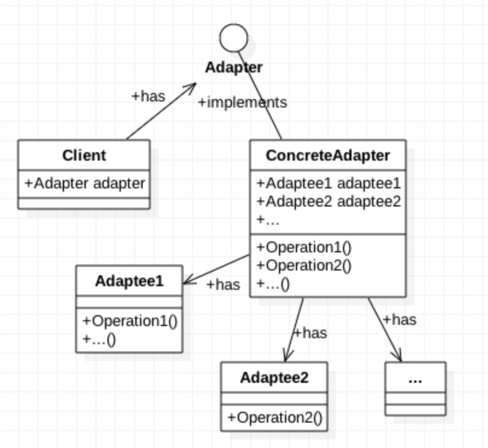
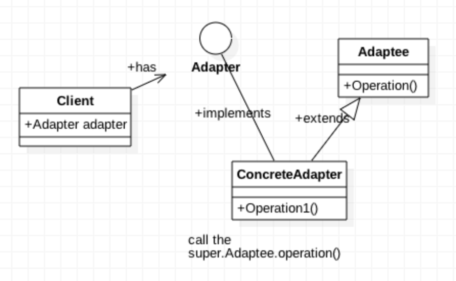
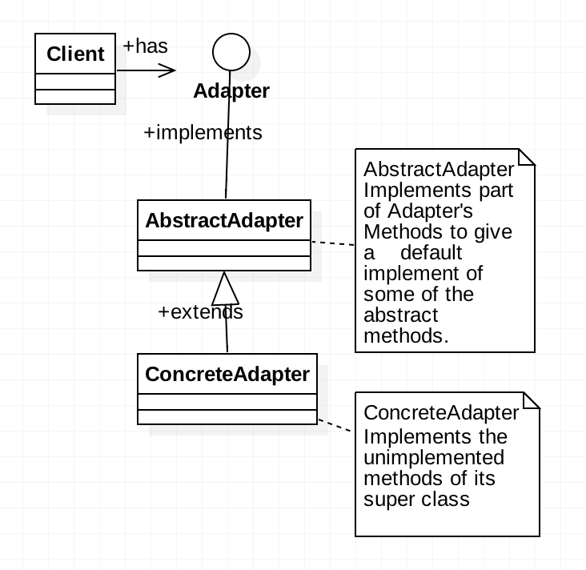

# 适配器模式 （Adapter Pattern）

|Author|CrazyWah|
|---|---|
|Date|2018-04-25|
|Copyright|crazywah.com|


适配器模式的提出是来源于解决兼容性的问题。在教科书中有一个很形象生动的例子：笔记本电脑，电源适配器和插座。

## 1、适配器模式的定义

**适配器模式（Adapter Pattern）** 将一个接口转换成为客户希望的另一个接口，使接口不兼容的那些类可以一起工作，其别名为包装器（Wrapper）。适配器模式既可以作为类结构模式，也可以作为对象结构模式。

## 2、对象适配器模式（最常用）

在对象适配器模式中，适配器与适配者之间是关联关系，即在适配器中有一个适配者的对象在里面，提供适当的方法给目标客户端调用。

### 2.1、对象适配器的类图



从图中可以明显地看出几个点：

1. Client并没有直接地调用具体Adapter的方法，而是调用的接口里面的方法，这就方便替换具体Adapter而不用大篇幅地修改Client的代码
2. 具体Adapter都必须实现Adapter接口，实现所有Adapter接口中的抽象方法
3. 每个具体的方法的实现交由具体的Adaptee实现，具体Adapter负责调用与之关联的Adaptee

### 2.2、对象适配器代码示例：

#### 2.2.1、适配器接口(Adapter)：一般只有一个

Adapter(适配器)接口主要是规范所有具体Adapter该有的操作

```java
  interface Adapter{
    void operation1();
    void operation2();
  }
```

#### 2.2.2、具体适配器(ConcreteAdapter)：可有多个

ConcreteAdapter(具体适配器)类主要是配合具体的Adaptee(适配者)具体地实现Adapter接口里的方法：

```java

  class ConcreteAdapter implements Adapter{

    //关联的Adaptee
    private Adaptee1 adaptee1;
    private Adaptee2 adaptee2;

    //配合着具体的Adaptee实现Adapter规范好的方法

    @Override
    public void operation1(){
      //具体操作...
      adaptee1.operation();
    }

    @Override
    public void operation2(){
      //具体操作...
      adaptee2.operation();
    }

  }

```

#### 2.2.3、适配者(Adaptee)：可有多个

Adaptee(适配者)主要是具体实现某些具体功能并等待被适配的类

```java
  class Adaptee1{
    public void operation(){
      //Adaptee1的功能需要做的具体操作
    }
  }
```

## 3、类适配器模式

在类适配器模式中，适配者与适配器之间是继承或实现的关系

### 3.1、类适配器类图



从图中看出来类适配器的几个特点

1. Client并没有直接地调用具体Adapter的方法，而是调用的接口里面的方法，这就方便替换具体Adapter而不用大篇幅地修改Client的代码
2. 具体的Adapter除了实现了Adapter接口以外，最大的特点就是它还继承了实现了具体操作的Adaptee。
3. Adaptee具体实现了大部分Adapter应该有的操作

### 3.2、类适配器代码示例

#### 3.2.1、适配器接口(Adapter)：一般只有一个

Adapter(适配器)接口主要是规范所有具体Adapter该有的操作

```java
  interface Adapter{
    void operation1();
    void operation2();
  }
```

#### 3.2.2、具体适配器(ConcreteAdapter)：可有多个

ConcreteAdapter(具体适配器)类主要是继承具体的Adaptee(适配者)并实现Adapter接口里的方法：

```java

  class ConcreteAdapter extends Adaptee implements Adapter{
    //配合着具体的父类Adaptee实现Adapter规范好的方法

    @Override
    public void operation1(){
      super.operation1();
    }

    @Override
    public void operation2(){
      super.operation2();
    }

  }

```

#### 3.2.3、适配者(Adaptee)：可有多个

Adaptee(适配者)主要是具体实现某些具体功能并等待被适配的

```java
  class Adaptee{
    public void operation1(){

    }

    public void operation2(){

    }
  }
```

## 4、缺省适配器模式

在缺省适配器模式重点是为Adapter接口给出不是必须实现的部分一个默认实现

### 4.1、缺省适配器的类图



从类图我们可以看出缺省适配器几个特点：

1. Client并没有直接地调用具体Adapter的方法，而是调用的接口里面的方法，这就方便替换具体Adapter而不用大篇幅地修改Client的代码
2. AbstractAdapter实现了Adapter一部分的接口方法
3. ConcreteAdapter和AbstractAdapter属于继承关系

### 4.2、缺省适配器代码示例

#### 4.2.1、适配器接口(Adapter)：一般只有一个

Adapter(适配器)接口主要是规范具体Adapter该有的操作

```java
  interface Adapter{
    void operation1();
    void operation2();
  }
```

#### 4.2.2、缺省适配器(AbstractAdapter):可有多个

AbstractAdapter(缺省适配器)主要是实现了Adapter接口中部分的方法，提供一个默认实现，当具体业务类需要改动是，可通过覆盖(Override)来实现改动

```java
  abstract class AbstractAdapter implements Adapter{

    @Override
    public void operation1(){
      //提供适当的默认实现
    }

  }

```

#### 4.2.3、具体业务类(ConcreteAdapter):可有多个

继承了AbstractAdapter的具体业务类，因为有了缺省适配器的帮忙，这里我们只需要实现剩余的尚未实现的方法即可

```java
  class ConcreteAdapter extends AbstractAdapter{

    @Override
    public void operation2(){
      //实现剩余的未实现方法
    }

  }
```

## 5、适配器模式的总结

### 5.1、优点：

无论是何种适配器模式都有以下优点：

1. 将目标客户端类(Target)和适配者类(Adaptee)解藕，通过引入一个适配器类(Adapter)来重用现有的适配者类而无需修改原有的结构
2. 增加了类的透明性和复用性，将具体的业务实现过程封装在适配者类中，对于客户端而言是透明的，而且提高了适配者类的复用性，同一个适配者类可以在不同的系统中复用
3. 灵活性和扩展性都非常好，通过使用配置文件可以很方便地更换适配器，也可以在不修改原有代码的情况下增加新的适配器类，完全符合开闭原则

类适配器模式还有如下优点：

1. 由于适配器是适配者的子类，因而可以置换一些适配者的方法，使得适配器灵活性更强。

对象适配器模式还有如下优点：

1. 一个适配器可以把多个不同的适配者适配到一个目标客户端。
2. 可以适配适配者的子类（里氏替换原则）

### 5.2、缺点：

对象适配器的缺点：

1. 和类适配器相对比，置换适配者的某个方法的过程比较复杂，如果非要置换某方法需要创建一个新的类继承它并进行覆盖

类适配器缺点：

1. 部分语言不支持多继承，限制了无法同时适配多个适配者类
2. 适配者类不可为最终类，因为如此即不可被继承
3. Java、C#的Adapter只能是抽象类，有一定局限性
