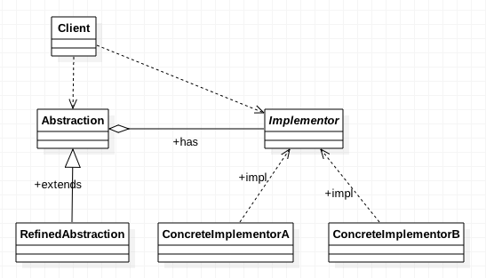

# 桥接模式 (Bridge Pattern)

|Author|CrazyWah|
|---|---|
|Date|2018-05-14|
|Copyright|crazywah.com|

## 1、桥接模式的定义

**桥接模式 (Bridge Pattern)** 将抽象部分与其实现部分分离，使他们都可以单独地变化。它是一种对象结构型模式，又称为 **柄体（Handle and Body)** 或者 **接口 (Interface) 模式**

## 2、桥接模式的类图

根据类图我们分析出桥接模式的以下特点

1. 扩充抽象类的类中所有维度的对象都来自于Client
2. 每一个维度都是一个抽象类，该维度上的每一个分支都是该抽象类的子类
3.

## 3、桥接模式代码示例
## 4、桥接模式总结
