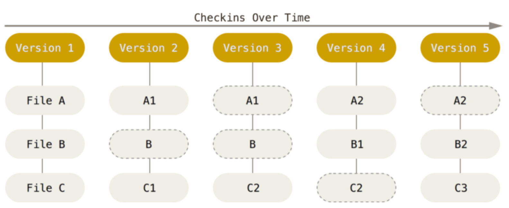

# Git（一） 基础知识

|Author|2015-区枫华|
|------|----------|
|Date  |2019-05-04|

本文将介绍 Git 的系统工作原理以及工作流程。

## 1、版本控制系统

**版本控制系统（Version Control System）是一种记录一个或若干个文件内容变化，以便将来查阅特定版本修订情况的系统。**

版本控制有多种实现方式：

1. 将每个版本的项目文件全部复制备份一遍。*（此方法最简单，但是容易犯错，而且占用大量空间）*

2. **修订控制系统** *（Revision Control System，缩写RCS）*。早期的本地版本控制系统，其原理为：**在硬盘上存储补丁集** *（补丁即文件修订前后的变化部分）*，**通过应用所有的补丁计算出各个版本的文件内容**。但是有个缺点，那就是这个只是本地的版本控制系统，其他人无法参与。

3. **集中化版本控制系统** *（Centralized Version Control Systems，缩写CVCS）*。它解决的主要问题是让不同的开发者协同工作。其原理为：**在服务器上保存所有文件的修订版本**，而协同工作的人们**都通过客户端连接到这台服务器，取出最新的文件或者提交更新**。但是有一个缺点，只要服务器宕机了，所有人都无法推或下拉文件。

4. **分布式版本控制系统**（*Distributed Version Control System*）。其原理为：每个客户端从服务端中拉取文件时，都是**直接将服务端的整个仓库拷贝下来，而非某个版本的文件**。只要保持适当的文件同步，客户端就能持有和服务端一样的文件仓库，在本地做版本的开发或回退，服务器宕机了也有整个文件仓库在本地，不影响操作。

**我们常用的 Git 属于分布式版本控制系统（DVCS）**。也正因如此，所有的 **Git 项目都会在客户端本地拥有一整个的文件仓库**，我们在不联网的情况下几乎可以进行所有的 Git 操作（除了 push 之类与远端仓库相关的操作）。如：commit 修改、查看项目历史记录、对比上个版本等等...。

## 2、Git 的文件存储方式

不同于其他的版本控制系统，Git 的文件存储方式主要是存储某版本下被改变的文件的 **快照（即某文件在某版本时的副本）**。在每一次的提交（commit）Git会存储被修改后的文件的快照，而在本次提交没有被修改的文件则会存储一个指向之前版本的快照的链接，不会重复存储。

*上图中 Version 对应每一次的 commit，没有虚线包裹的代表与上版本快照不一致的新版本的文件快照；虚线包裹的代表它与上版本的快照无异，所以仅仅是一个指向上版本快照的链接。*

因为 Git 存储的其实是一些文件的副本，所以也可以认为 Git 是一个小型的文件管理系统。

在每一次的 commit 时，Git 会对文件进行校验和的计算（*根据变更的文件内容或变更的文件目录进行[SHA-1 哈希值](https://www.baidu.com/sf_bk/item/SHA1/8812671?fr=aladdin&ms=1&rid=11356797863123647547)计算得到一个唯一（绝大多数情况下）的40位16进制的哈希值，该哈希值形如：24b9da6552252987aa493b52f8696cd6d3b00373*）作为该次 commit 的校验信息。**Git 通过校验和计算出来是否一致感知文件的变化**。**同理，每一个 commit 都有其唯一对应的校验和作为其索引**。

## 3、Git 的文件状态

### 3.1、文件区域

在 Git 中一共分三个文件区域：

1. **工作区**：从代码仓库复制出来的对应版本的工作副本。在这区域内的文件有三种状态。**未跟踪**、**已跟踪但未修改**、**已跟踪且已修改**。
2. **暂存区**：暂存区其实是一个文件，存放着下一次即将提交的文件信息。当一个文件的信息被放入暂存区时，该文件的状态就是**已存储状态**。
3. **Git 仓库**：存放着每一个已提交的版本的文件快照。这当中的文件都处于**已跟踪未修改**状态

### 3.2、文件状态

对应上述文件区域中提到 Git 的五种文件状态：

1. **已跟踪**：已跟踪指的是已经纳入 Git 版本管理，在暂存区有其相关信息或在 Git 仓库中有其快照的文件。除了未跟踪外的状态都是基于已跟踪状态的。
2. **未跟踪**：未跟踪指的是在 Git 仓库中没有任何版本快照，也没有添加到暂存区的文件。
3. **未修改**：未修改指的是从 Git 仓库中的某版本拉取出来以后直到工作完成都没有被修改过或修改过但与修改前完全一摸一样的文件。
4. **已修改**：已修改指的是工作过程当中修改过并与 Git 仓库中版本快照有区别的文件。
5. **已存储**：已存储指的是已经将文件信息添加到暂存区的文件。

## 5、总结

以上内容就是作者在看完《ProGit_v2.1.16》后关于 Git 工作原理与工作流程的一些总结。其中最重要的内容是理解 **Git 是怎样的版本控制系统、如何存取不同版本的文件以及Git中文件状态的变化**。

## 参考文献

* 《ProGit_v2.1.16》Page 7～22