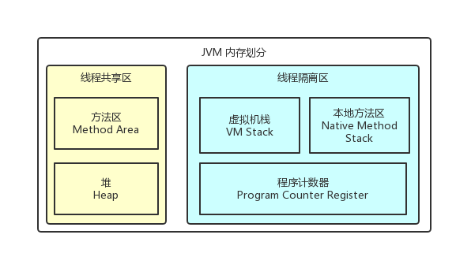

# Java内存管理
* Author：CrazyWah
* Date：2018.04.15
* Copyright：crazywah.com

## 1、JVM的内存划分

### 1.1、Java的内存分为线程共享区与线程隔离区

**线程共享区中有：** 方法区、堆

**线程隔离区中有：** 虚拟机栈、本地方法区、程序计数器

### 1.2、程序计数器（Program Counter Register）

**程序计数器** 是一块较小的内存空间，可以当作当前线程执行的 **字节码的行号指示器**

**字节码解释器** 就是通过改变 **程序计数器的值** 来选取 **下一条需要执行的字节码指令**

**Java虚拟机** 的 **多线程** 是通过 **线程轮流切换** 并 **分配处理器执行时间** 的方式来实现的，在任意一个确定的时刻，一个处理器都只会执行一个线程的一条指令，所以 **程序计数器相应的就应该是一个线程拥有一个（安排在线程隔离区）**

***PS：此区域没有OOM问题***

### 1.3、Java虚拟机栈（Java Virtual Machine Stack）

Java中每个方法执行时都会创建一个栈帧，用于存放局部变量表、操作数栈、动态链接、方法出口等数据。

线程私有。

虚拟机栈就是常说的“Java的堆和栈”的“栈”了

**局部变量表：**
  * 编译期可知的各种基本数据类型
  * 对象引用类型（非对象本身，而是指向对象起始地址的指针）
  * long & double 这两个64位数据占两个局部变量空间（Slot），其他类型数据占一个。

**异常：**
  * StackOverflowError：线程申请的的栈深度超出虚拟机所允许的深度
  * OutOfMemoryError：无法申请足够内存扩展空间时

**运行时常量池** 是方法区的其中一个区域，用于存放*编译期*生成的各种字面量和符号引用。这部分内容在累加载以后存放在运行时常量池。

可抛出的异常：
* SOF
* OOM

### 1.4、Java 堆（Java Heap）

Java 堆在 JVM 启动时创建，并且只用于存储**对象实例**。

该区域的回收便是我们熟悉的 GC

线程共享。

可抛出的异常：
* OOM

### 1.5、方法区（Method Area）

用于存储：
1. 已加载的类信息
2. 常量
3. 静态变量
4. 即时编译器编译后的代码

可抛出的异常
* OOM

### 1.6、对象访问

两种主流的 JVM 实现方式：
1. 句柄池：从 Java 堆中划分一部分空间，用于记录不同的**对象实例数据（obj）**、**对象类型数据(Class<*>)**对应的地址。Java 栈的变量表中的变量指向句柄池，透过对应的地址去访问具体的数据。
  * 优势：变量表中存储的是稳定的句柄位置。每一次对象数据移动时，只需要更新句柄池中的地址，变量表无感知
2. 直接指针：Java 栈的变量表中的变量直接指向数据本身。
  * 优势：速度更快。比句柄池节省了一次指针定位操作。

## 2、GC

### 2.1 如何判定对象已死

#### 引用计数法

一个对象的数据结构中，维护一个引用计数变量。每有一个新的引用他的时候就 +1，引用失效时 -1，当引用数为 0 时，即为无用对象。

优势：简单，判定效率高

***但是无法解决对象循环引用的问题***

例如 A -> B 然后 B -> A。这时候两个对象的引用数都为 1，但是如果他们都没有其他外部引用，那就是无用对象，但是在引用计数法中却没法销毁。

#### 根搜索法

根搜索法核心思想并不是判断对象是否已'死'，而是判断是否还'活着'。

从一些列的 'GC Root' 出发，找出 GC Root 以及所有其直接或间接引用的子节点，这些对象都被认定为'存活'的对象，随后将这些存活的对象搬运到其他的内存区域以后便将当前的内存区域清空。

#### 引用类型

* 强引用：打死都不回收
* 软引用：OOM 之前回收
* 弱引用：GC 时一定回收
* 虚引用：不算引用，但是能用于监听对象的 GC 情况

#### 回收之二次扫描

当根搜索法发现一个不可到达的对象时，会做一个判断：

如果符合以下条件之一

* 复写过 finalize() 方法
* 未执行过 finalize() 方法

判‘缓刑’先执行以下它的 finalize() 方法，下一次在清理

### 2.2、清理方法

#### 2.2.1、标记 - 清理

对堆全面扫描，一轮扫描标记无效对象，二轮扫描清除无效对象。

* 优点
  * 实现简单
* 缺点
  * 效率低（？）
  * 导致空间不连续，遇到需要大空间的时候需要多次触发 GC

#### 2.2.2、复制

对堆正在使用的区域做一次扫描

#### 2.2.3、标记 - 整理